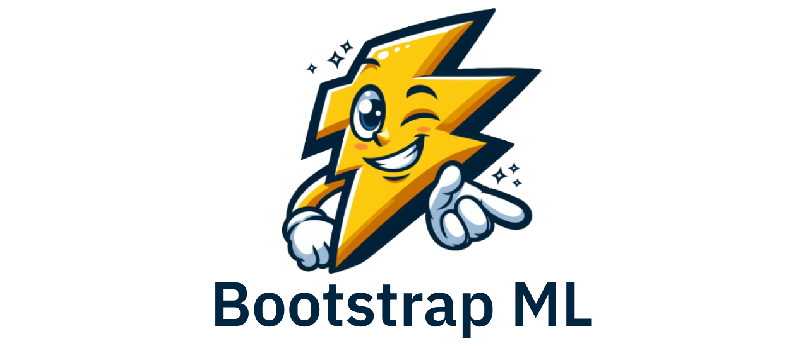

# Bootstrap ML

**Bootstrap ML** is a comprehensive collection of pre-written code for machine learning and deep learning use cases, all in one convenient place. Whether you're a seasoned practitioner or just starting your ML journey, this repository provides a solid foundation to build upon.

## What Is It About?

**Bootstrap ML** aims to accelerate your machine learning and deep learning projects by providing reusable, well-documented code snippets and notebooks. It covers a range of use cases, from quick starts to advanced neural network implementations.

### Folder Overview

- **0_quick_start**:
  - `0_logging_device_placement.py`: Logs device placement to help identify performance bottlenecks.

- **1_keras_api**:
  - `1_numbers_classification.ipynb`: Notebook demonstrating number classification using Keras.
  - `2_sequential_model.py`: Basic Sequential model example using Keras.
  - `3_basic_classification.ipynb`: Notebook for basic classification using Keras.
  - `4_text_classification.ipynb`: Notebook for text classification using Keras.

- **2_estimators**:
  - `2_1_linear_model.ipynb`: Notebook demonstrating a linear model implementation using TensorFlow Estimators.

- **19_lingvo**:
  - `19_1_task_config.py`: Task configuration example using the Lingvo framework.

- **20_tf2**:
  - `20_1_actor_critic_agent.ipynb`: Notebook demonstrating an Actor-Critic agent.
  - `20_2_a2c.py`: Advantage Actor-Critic (A2C) implementation.

- **777_workarounds**:
  - `777_1_tf2_cuda10.py`: Workaround for TensorFlow 2.x with CUDA 10 compatibility issues.

## Benefits

- **Plug-and-Play**: Pre-written, reusable code that can be easily integrated into your projects.
- **Wide Range of Use Cases**: From data preprocessing to advanced neural network models.
- **Scalable and Efficient**: Optimized for both small-scale experiments and large-scale production workloads.
- **Customizable**: Easily modify and extend the code to suit your specific needs.

## TODO List

- [ ] Add more examples for TensorFlow 2.x.
- [ ] Add the most used deep learning architectures with practical examples.
- [ ] Expand the Lingvo framework examples.
- [ ] PyTorch models and examples.
- [ ] Add enchmarking suite for model comparisons.

## Contributing

I've been working on this repo on my free time contributing on and off as I had free time. Here's how you can get involved:

1. Fork the repository.
2. Create a new branch (`git checkout -b feature-branch`).
3. Make your changes and commit them (`git commit -m 'Add new feature'`).
4. Push to your branch (`git push origin feature-branch`).
5. Create a new Pull Request.

Feel free to reach out for questions, suggestions, or feedback!

-- Andrew
